# 图论及其应用：第一周课程总结

第一周主要解决两个问题：什么样的对象可以称为“图”，以及怎样用顶点、边、度、同构和度序列这些基本语言描述一张图。下面的图示默认把边画成无向边；若图中出现方向、权重或多重边，需要在定义中额外说明。

## 模块一：图的数学定义与核心术语

### 1. 图的集合表示

图通常记作

$$
G=(V,E)
$$

其中 $V$ 是非空有限集合，元素称为**顶点**；$E$ 是边的集合。若讨论无向简单图，边可以看成 $V$ 中两个不同顶点构成的无序对。

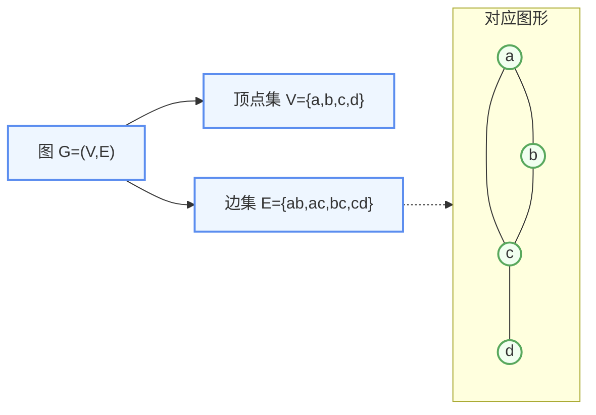

### 2. 阶数、边数、关联与相邻

* **阶数**：顶点数，记作 $n(G)=|V|$。
* **边数**：边数，记作 $m(G)=|E|$。
* 若边 $e$ 的端点是 $u,v$，记作 $e=uv$，则称 $e$ 与 $u,v$ **关联**。
* 若两个顶点被同一条边连接，则称这两个顶点**相邻**。
* 若两条边有公共端点，则称这两条边**相邻**。

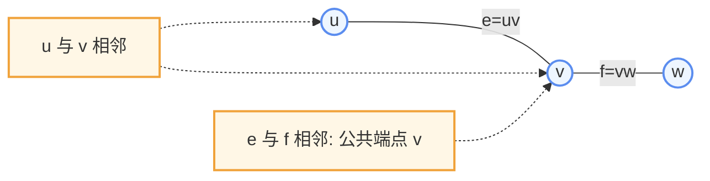

## 模块二：图的分类与数学特征

### 1. 平凡图、空图、简单图

* **平凡图**：$n(G)=1$ 且 $m(G)=0$。
* **空图**：$m(G)=0$。注意空图可以有多个顶点，只是没有边。
* **简单图**：不含环、不含重边的图。课程中若没有特别说明，通常默认讨论简单图。

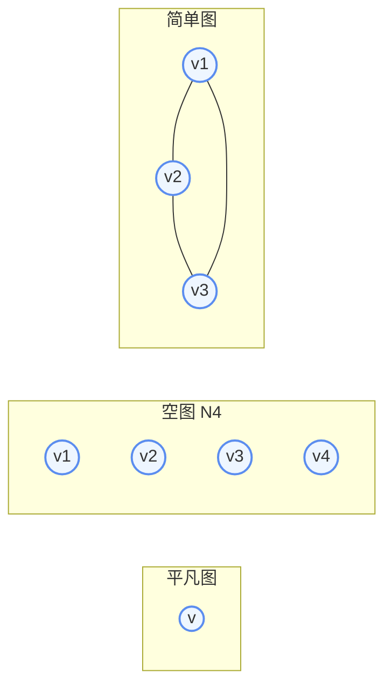

### 2. 环与重边

**环**是端点重合的边，即 $e=uu$；**重边**是连接同一对顶点的多条边。含环或重边的图不是简单图。

Mermaid 不适合精确画重边，这里用两条标注边表达“同一对端点之间有多条边”的意思。

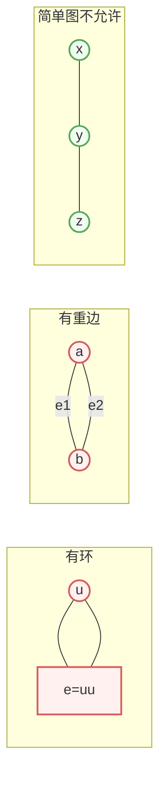

## 模块三：特殊形态的图与公式

### 1. 完全图

**完全图**是任意两个不同顶点之间都恰好有一条边相连的简单图，$n$ 阶完全图记作 $K_n$。

$$
m(K_n)=\frac{n(n-1)}{2}
$$

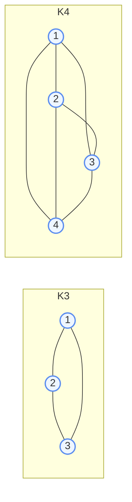

公式的来源是：每条边对应一个二元顶点子集，所以边数就是从 $n$ 个顶点中选 $2$ 个的组合数。

### 2. 二部图与完全二部图

若顶点集能分成两个非空且不相交的部分 $X,Y$，并且所有边都跨越 $X$ 与 $Y$，则称图为**二部图**。

完全二部图 $K_{m,n}$ 表示 $X$ 中每个顶点都与 $Y$ 中每个顶点相连：

$$
m(K_{m,n})=mn
$$

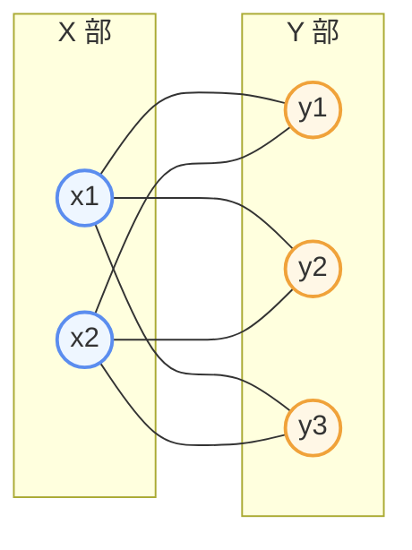

上图是 $K_{2,3}$。二部图的常用判定定理是：一个图是二部图当且仅当它不包含奇圈。

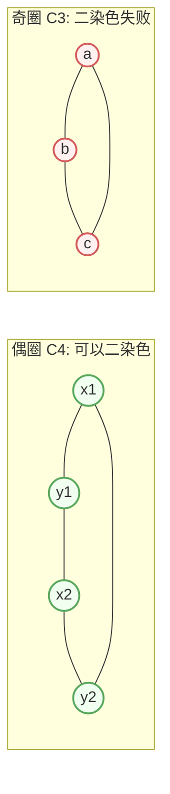

### 3. 补图

对于简单图 $G=(V,E)$，它的**补图**记作 $\bar{G}=(V,\bar{E})$。补图与原图顶点集相同，边集取完全图 $K_n$ 中那些不属于 $E$ 的边。

$$
m(G)+m(\bar{G})=\frac{n(n-1)}{2}
$$

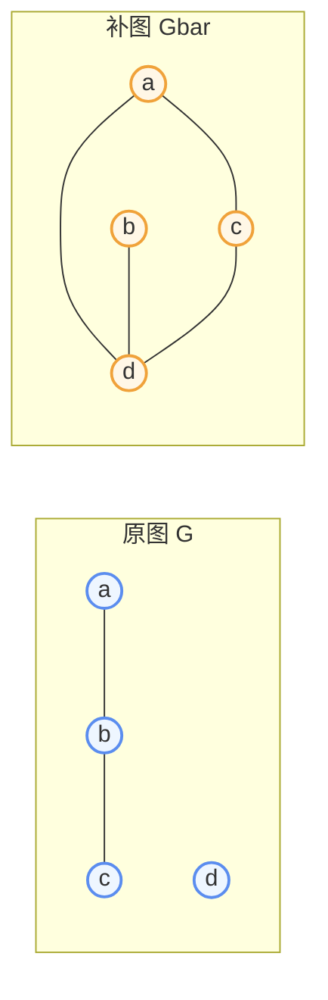

原图中有 $ab,bc$，所以补图中不再出现这两条边，而补上 $ac,ad,bd,cd$。

### 4. 正则图

若图中每个顶点的度都等于 $k$，则称图为 **$k$-正则图**。因为所有度数之和等于 $nk$，由握手定理可得：

$$
nk=2m
$$

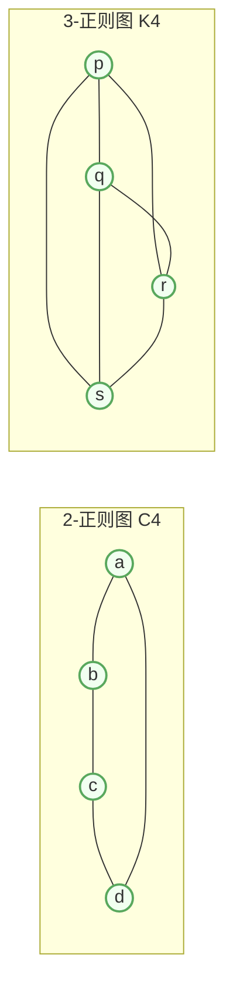

若 $n$ 与 $k$ 同时为奇数，则 $nk$ 是奇数，不可能等于偶数 $2m$。所以正则图的阶数和度数不能同时为奇数。

## 模块四：图的同构

### 1. 同构定义

设 $G_1=(V_1,E_1)$，$G_2=(V_2,E_2)$。若存在双射

$$
f:V_1\to V_2
$$

使得任意 $u,v\in V_1$ 都满足

$$
uv\in E_1 \Longleftrightarrow f(u)f(v)\in E_2,
$$

则称 $G_1$ 与 $G_2$ 同构，记作 $G_1\cong G_2$。

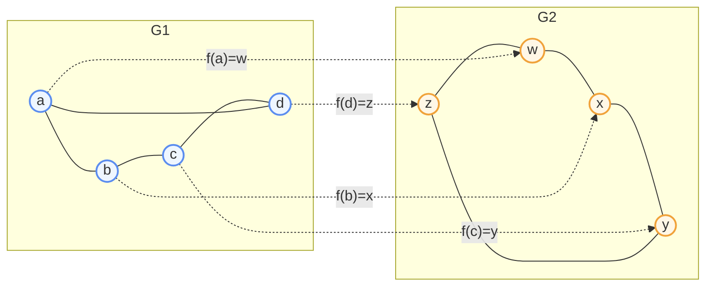

同构强调“连接关系一样”，不是“画出来的位置一样”。一张图可以被拉伸、旋转、换名字，只要邻接关系保持不变，就仍然是同构的。

### 2. 同构的必要条件

判断同构时常先检查必要条件：

* $n(G_1)=n(G_2)$；
* $m(G_1)=m(G_2)$；
* 度序列完全相同；
* 圈的结构、连通分支数等结构特征相同。

这些条件是必要条件，不一定是充分条件。也就是说，条件不满足时一定不同构；条件满足时还要继续找具体的顶点对应。

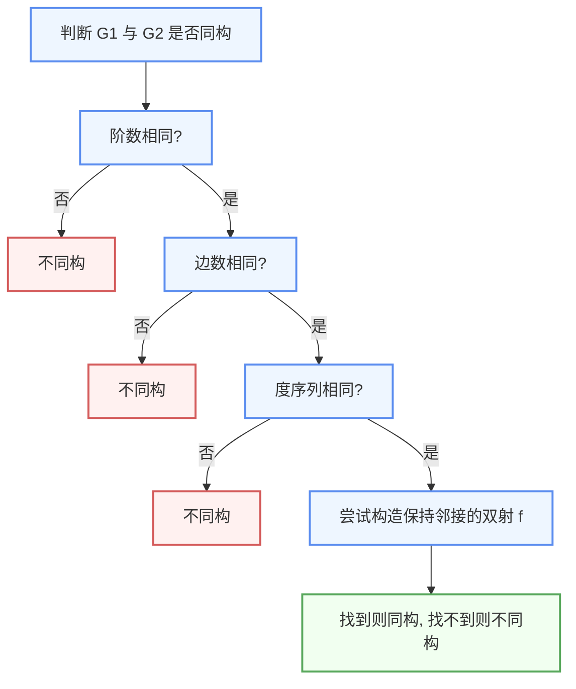

## 模块五：顶点的度与基本定理

### 1. 度、最大度与最小度

与顶点 $v$ 关联的边数称为 $v$ 的**度**，记作 $d(v)$。若允许环，每个环在计算度数时算作 $2$ 次。

图中所有顶点度的最大值记作 $\Delta(G)$，最小值记作 $\delta(G)$。对 $n$ 阶简单图，有：

$$
0\le \delta(G)\le d(v)\le \Delta(G)\le n-1
$$

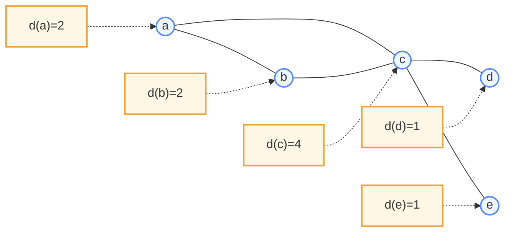

上图的度序列为 $(4,2,2,1,1)$，所以 $\Delta(G)=4$，$\delta(G)=1$。

### 2. 握手定理

在任何图 $G=(V,E)$ 中，所有顶点的度数之和等于边数的两倍：

$$
\sum_{v\in V}d(v)=2m
$$

原因是：每条边有两个端点，因此在统计所有顶点度数时，每条边都被数了两次。

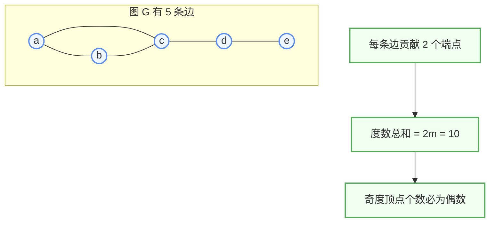

推论：任意图中，奇度顶点个数一定是偶数。因为所有度数之和是偶数，而偶数度顶点的贡献本来就是偶数，所以奇数度顶点的个数也必须为偶数。

### 3. 至少两个顶点度数相同

**定理 4**：任何阶数 $n\ge 2$ 的简单图中，至少有两个顶点的度数完全相同。

证明思路是鸽巢原理。简单图中每个顶点的度数只能在 $0$ 到 $n-1$ 之间取值，但不可能同时出现度数 $0$ 和度数 $n-1$：若有一个顶点度数为 $n-1$，它与所有其他顶点相邻，就不会存在孤立点。

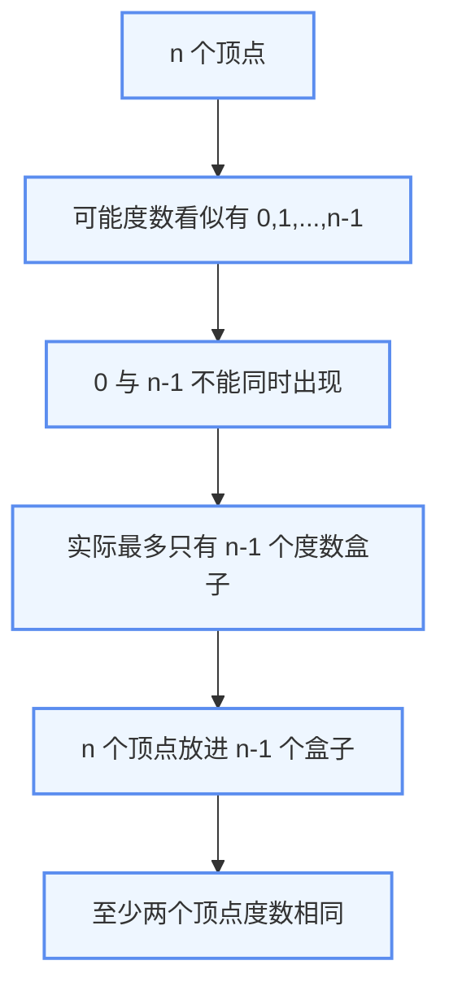

## 模块六：度序列与可图化判定

### 1. 度序列与可图化

将图中所有顶点的度按照从大到小排列，得到的非负整数序列称为**度序列**，常记作

$$
\Pi=(d_1,d_2,\dots,d_n),\qquad d_1\ge d_2\ge \cdots\ge d_n
$$

若存在一个简单图以该序列作为度序列，则称这个序列是**可图的**。

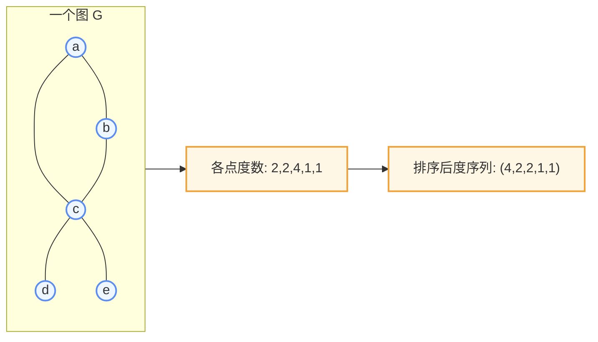

度序列判定先看两个必要条件：

* 度数之和必须为偶数；
* 最大度必须满足 $d_1\le n-1$。

但这两个条件还不够，还需要 Havel-Hakimi 定理。

### 2. Havel-Hakimi 定理

对非负整数序列

$$
\Pi=(d_1,d_2,\dots,d_n),\quad d_1\ge d_2\ge \cdots\ge d_n,
$$

删除第一项 $d_1$，并把后面 $d_1$ 项各减 $1$，得到衍生序列：

$$
\Pi'=(d_2-1,d_3-1,\dots,d_{d_1+1}-1,d_{d_1+2},\dots,d_n)
$$

则 $\Pi$ 可图当且仅当 $\Pi'$ 可图。

直观理解：度最大的那个顶点需要连出 $d_1$ 条边，于是先让它连接当前度数最高的 $d_1$ 个顶点，并把这些顶点的剩余需求各减 $1$。

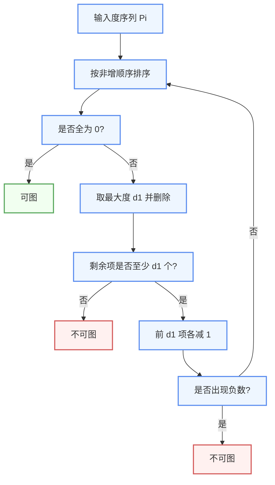

### 3. 一个完整例子

判断序列 $(3,3,2,2,2)$ 是否可图：

对应的一张简单图可以画成：

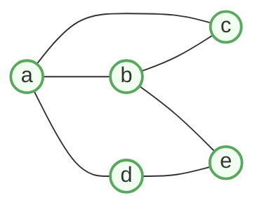

顶点度数分别为 $3,3,2,2,2$，与原序列一致。

## 本周知识图谱

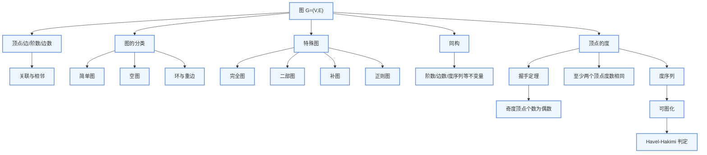

第一周的核心是把图论语言搭起来：先用 $G=(V,E)$ 描述对象，再用度、特殊图、同构和度序列这些工具提取结构信息。后续的子图、连通性、最短路和矩阵表示都建立在这些基本概念之上。
