# 图论及其应用：第二周课程总结

本周课程核心涵盖三个基本模块：子图与图的运算、图的连通性与最短路算法、以及图的代数表示。

如果第一周是在认识“什么是图”，第二周就开始把图当成一个可以被拆开、拼接、计算和矩阵化的对象。下面的图示都只画简单图；若讨论多重图，边的重数要按课程定义单独处理。

## 模块一：子图的概念与图的运算

### 1. 子图、真子图、生成子图

设 $G=(V,E)$。若 $V(H)\subseteq V(G)$ 且 $E(H)\subseteq E(G)$，并且 $H$ 中每条边的端点仍在 $V(H)$ 中，则称 $H$ 是 $G$ 的**子图**，记作 $H\subseteq G$。

* **真子图**：$H\subseteq G$ 但 $H\ne G$。
* **生成子图**：$V(H)=V(G)$，也就是顶点一个不少，只删边不删点。
* 若简单图 $G$ 有 $m$ 条边，则每条边都有“保留 / 删除”两种选择，所以 $G$ 有 $2^m$ 个不同的生成子图。

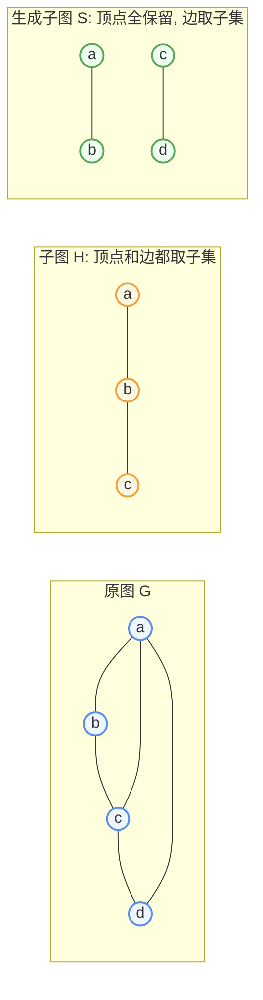

直观上，普通子图可以“删点也删边”；生成子图不能删点，只能在边集上做选择。

### 2. 导出子图

导出子图的重点是“选定一部分对象后，剩下的结构自动补齐”。

* **顶点导出子图** $G[X]$：先选顶点集 $X\subseteq V(G)$，再把 $G$ 中端点都落在 $X$ 里的边全部带上。
* **边导出子图** $G[F]$：先选边集 $F\subseteq E(G)$，再把这些边的端点全部带上。

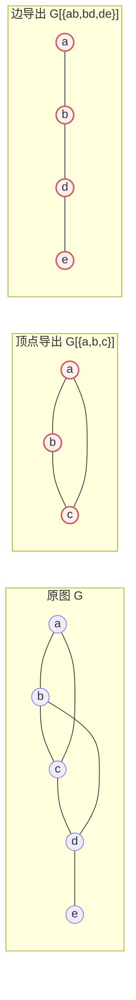

顶点导出子图容易漏掉边：只要两个被选顶点在原图中相邻，这条边就必须出现。边导出子图则不会额外补边，只补这些边所需要的端点。

### 3. 并、交、差、对称差

先固定两个图作为例子：

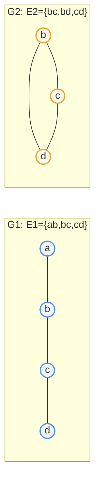

* **并** $G_1\cup G_2$：顶点和边分别取并集。
* **交** $G_1\cap G_2$：顶点和边分别取交集。
* **差** $G_1-G_2$：保留 $G_1$ 的顶点，删除 $G_1$ 与 $G_2$ 共有的边。
* **对称差** $G_1\oplus G_2$：保留只属于其中一个图的边，删除公共边。

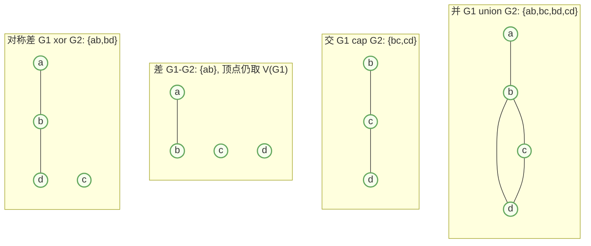

对称差可以记成“异或”：公共边被抵消，只留下两个图各自独有的边。

### 4. 联

若 $G_1$ 与 $G_2$ 的顶点不相交，二者的**联**常记作 $G_1\vee G_2$。它先取并，再把 $G_1$ 中每个顶点与 $G_2$ 中每个顶点全部连边。

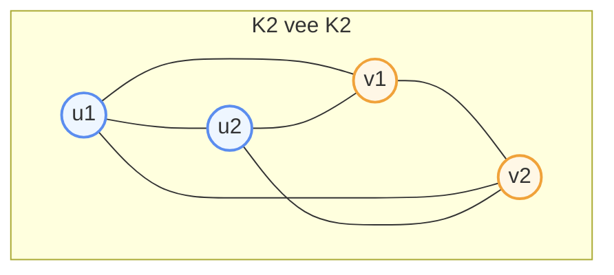

例子里两个 $K_2$ 做联后，每一对不同顶点都相邻，因此得到 $K_4$。

### 5. 积

课程中的“积”通常指**笛卡尔积图**，记作 $G\square H$。它的顶点是有序对：

$$
V(G\square H)=V(G)\times V(H)
$$

两个顶点 $(g,h)$ 与 $(g',h')$ 相邻，当且仅当满足下面两种情况之一：

* $g=g'$ 且 $hh'\in E(H)$；
* $h=h'$ 且 $gg'\in E(G)$。

也就是说，每一层像一个 $H$，不同层之间按照 $G$ 的边对应连接。

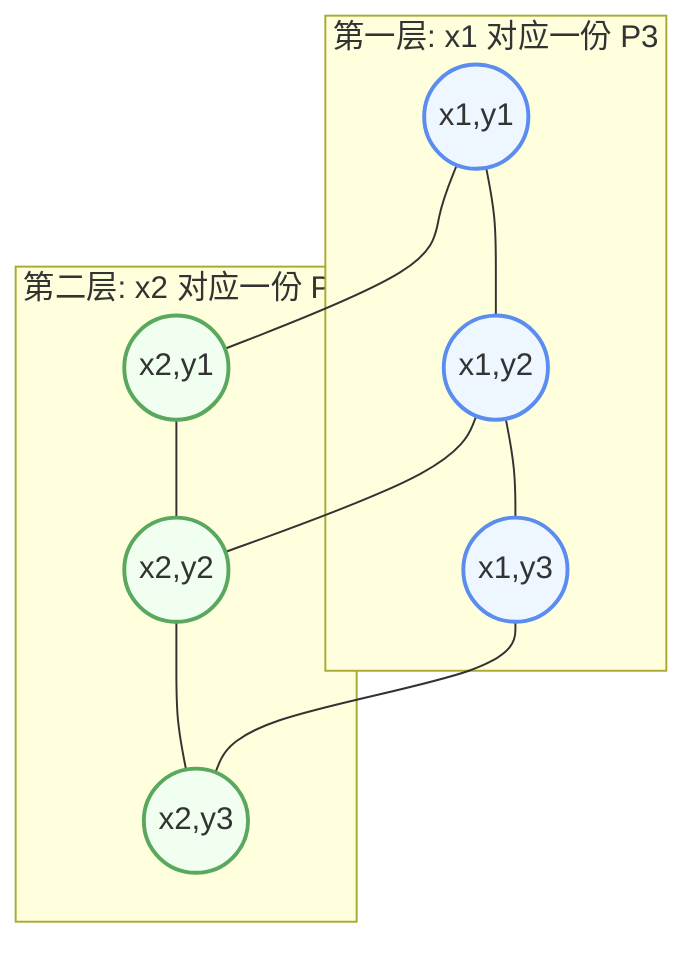

上图就是 $P_2\square P_3$，形状是一个 $2\times 3$ 网格。更高维的超立方体也可以这样理解：$Q_n=K_2\square Q_{n-1}$。

### 6. 合成

图的**合成**也常称为字典积或复合，记作 $G[H]$。它把 $G$ 的每个顶点替换成一整份 $H$：

* 每份内部保留 $H$ 的边；
* 若 $g_ig_j\in E(G)$，则第 $i$ 份 $H$ 与第 $j$ 份 $H$ 之间做全连接；
* 若 $g_i$ 与 $g_j$ 在 $G$ 中不相邻，则两份之间不加边。

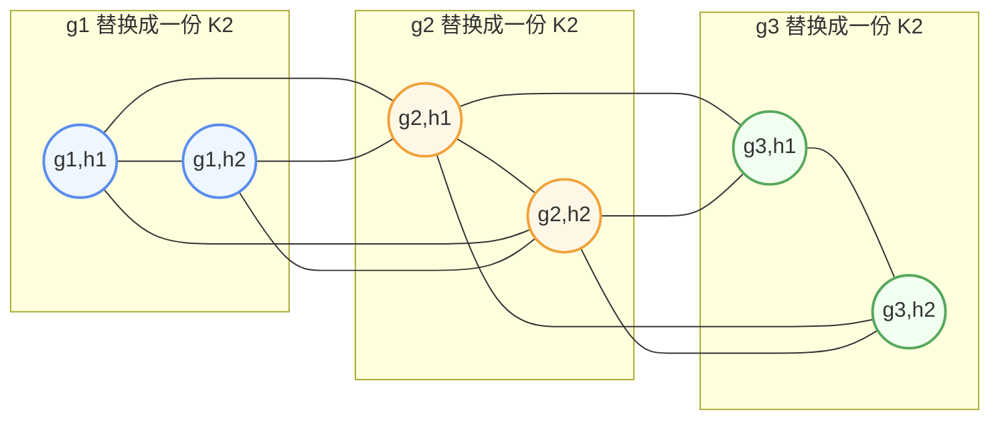

上图是 $P_3[K_2]$。因为 $g_1g_2$ 与 $g_2g_3$ 是 $P_3$ 的边，所以相邻两份 $K_2$ 之间全连接；但 $g_1$ 与 $g_3$ 不相邻，所以第一份和第三份之间没有连边。这个定义明显依赖“谁替换谁”，所以合成一般不满足交换律。

## 模块二：图的连通性与最短路算法

### 1. 途径、迹、路、圈

这几个概念都描述“从一个顶点走到另一个顶点”，区别在于允许重复的程度。

* **途径**：点边交替序列，允许顶点和边重复。
* **迹**：边互不相同的途径，但顶点可以重复。
* **路**：顶点互不相同的途径，因此边也不会重复。
* **圈**：起点等于终点的闭迹，且除起点和终点外，其余顶点互不相同。

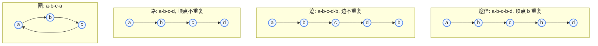

可以按限制强弱记忆：

$$
\text{路} \Rightarrow \text{迹} \Rightarrow \text{途径}
$$

圈是闭合版本的特殊迹。

### 2. 连通图与连通分支

若图中任意两个顶点之间都有路相连，则图是**连通图**。若不是连通图，可以按“是否互相可达”把顶点分成若干等价类，每个等价类诱导出的最大连通子图称为一个**连通分支**。

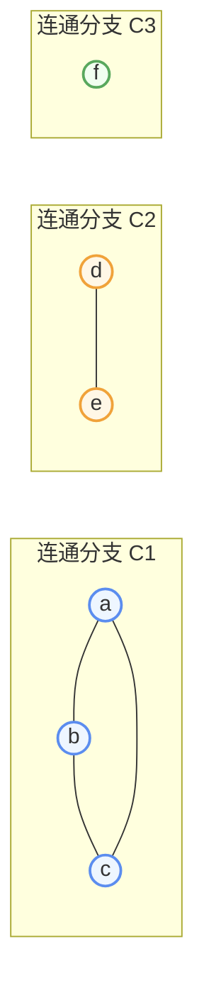

上图不是连通图，因为任意一个分支中的点都无法到达其他分支中的点。

### 3. 偶图与奇圈判定

课程中的**偶图**可以理解为二部图：顶点集能分成两个部分 $X,Y$，每条边都跨越两部分，不允许同一部分内部连边。

**定理 8**：一个图是偶图当且仅当它不包含奇圈。

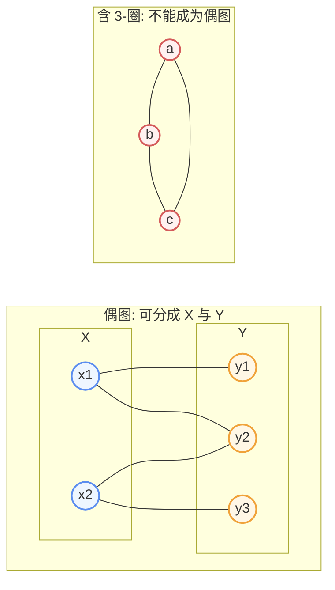

奇圈会让二染色失败：沿着圈交替染色，走回起点时会要求起点同时属于两个不同部分。

### 4. 最短路问题与标号法

赋权图中的单源最短路问题是：给定起点 $s$，求它到其他所有顶点的最短距离。课程中的**标号法**本质上就是 Dijkstra 思想，适用于边权非负的图。

核心过程：

1. 给源点 $s$ 标号 $0$，其余顶点标号为 $\infty$。
2. 每次选取当前未确认顶点中标号最小的顶点，加入已确认集合。
3. 用它更新邻接顶点的距离标号。
4. 重复直到所有可达顶点都被确认。

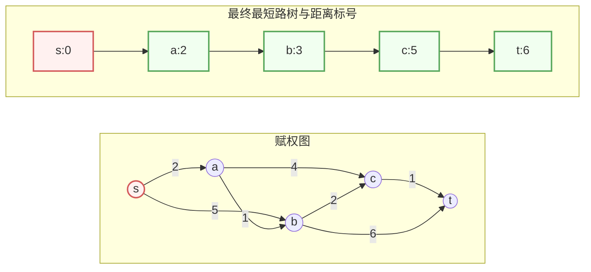

如果用邻接矩阵存图，朴素标号法的时间复杂度为 $O(n^2)$：每轮要在线性范围内找一个最小的未确认标号，共进行 $n$ 轮。

## 模块三：图的代数表示与总结

### 1. 邻接矩阵

给定顶点顺序 $v_1,v_2,\dots,v_n$，简单图的**邻接矩阵** $A=(a_{ij})$ 定义为：

$$
a_{ij}=
\begin{cases}
1, & v_i v_j\in E(G),\\
0, & v_i v_j\notin E(G).
\end{cases}
$$

对无向简单图，邻接矩阵是对称矩阵，且主对角线全为 $0$。

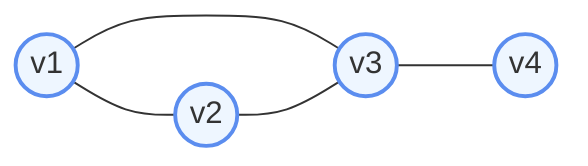

以上图为例，顶点顺序取 $v_1,v_2,v_3,v_4$，则邻接矩阵为：

| $A$ | $v_1$ | $v_2$ | $v_3$ | $v_4$ |
|---|---:|---:|---:|---:|
| $v_1$ | 0 | 1 | 1 | 0 |
| $v_2$ | 1 | 0 | 1 | 0 |
| $v_3$ | 1 | 1 | 0 | 1 |
| $v_4$ | 0 | 0 | 1 | 0 |

### 2. 关联矩阵

若边顺序取

$$
e_1=v_1v_2,\quad e_2=v_1v_3,\quad e_3=v_2v_3,\quad e_4=v_3v_4,
$$

则**关联矩阵** $B=(b_{ij})$ 用来表示顶点 $v_i$ 是否与边 $e_j$ 关联。

| $B$ | $e_1$ | $e_2$ | $e_3$ | $e_4$ |
|---|---:|---:|---:|---:|
| $v_1$ | 1 | 1 | 0 | 0 |
| $v_2$ | 1 | 0 | 1 | 0 |
| $v_3$ | 0 | 1 | 1 | 1 |
| $v_4$ | 0 | 0 | 0 | 1 |

简单图中每条边有两个端点，所以关联矩阵的每一列恰好有两个 $1$。

### 3. 邻接矩阵幂的几何意义

**定理 10**：邻接矩阵 $A^k$ 的 $(i,j)$ 元素等于从 $v_i$ 到 $v_j$ 长度为 $k$ 的途径数。

为什么矩阵乘法会数途径？以 $A^2$ 为例：

$$
(A^2)_{ij}=\sum_{r=1}^{n} a_{ir}a_{rj}
$$

每个中间顶点 $v_r$ 都贡献一次判断：若 $v_i$ 能走到 $v_r$，并且 $v_r$ 能走到 $v_j$，就得到一条长度为 $2$ 的途径 $v_i\to v_r\to v_j$。

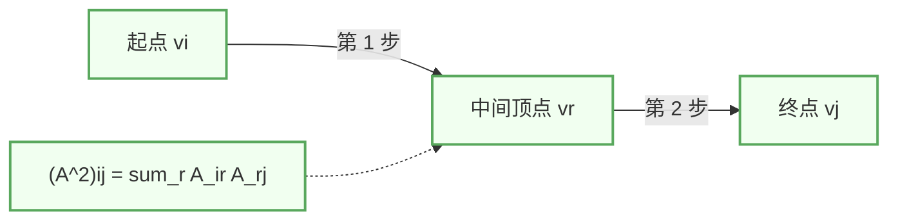

由此得到两个常用推论：

* **推论 1**：$(A^2)_{ii}=d(v_i)$。从 $v_i$ 出发走两步又回到 $v_i$，等价于先选一个与 $v_i$ 相邻的点再走回来，因此数量就是 $v_i$ 的度。
* **推论 2**：$(A^3)_{ii}$ 等于包含 $v_i$ 的三角形数目的两倍。因为一个三角形经过 $v_i$ 时，可以顺时针走一圈，也可以逆时针走一圈。

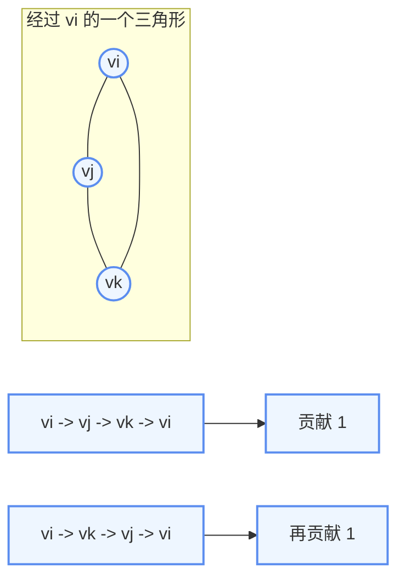

### 4. 本周知识图谱

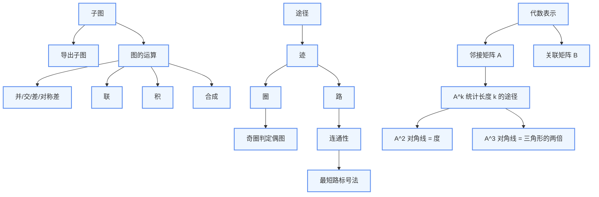

本周内容可以用一句话串起来：子图和运算负责“构造图”，连通性和最短路负责“在图上行走”，矩阵表示负责“把图转化为可计算的代数对象”。
