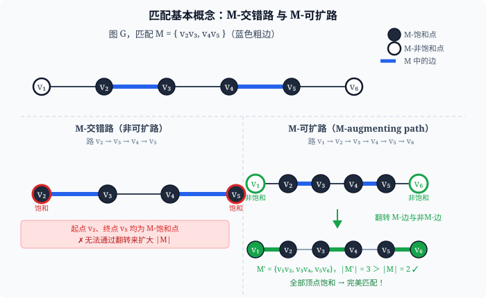
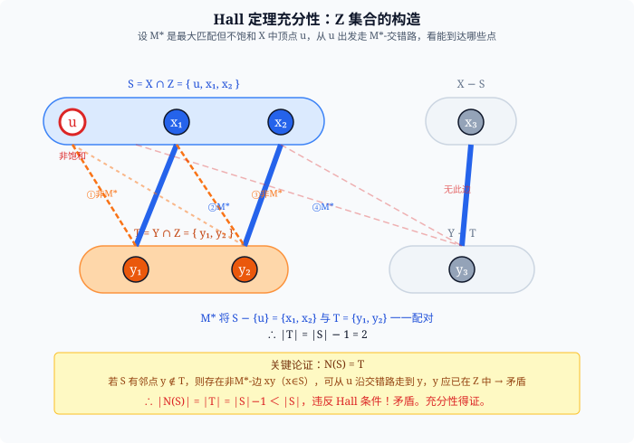
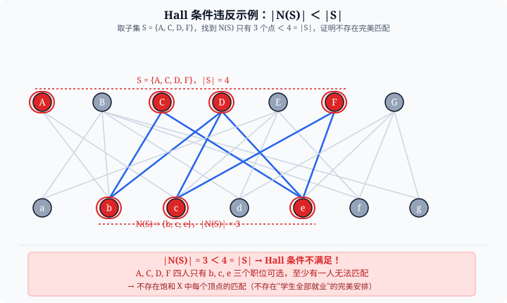
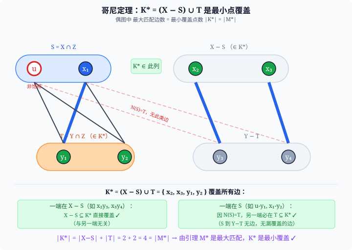
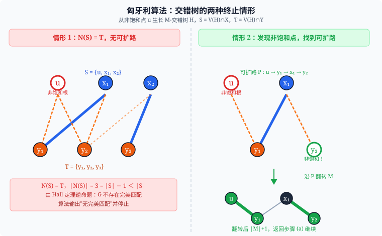
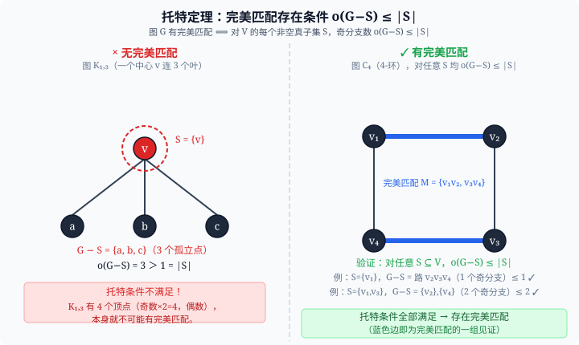
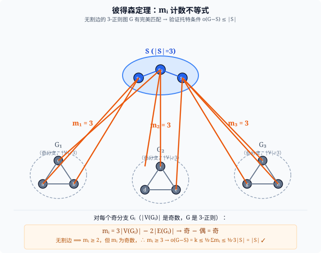
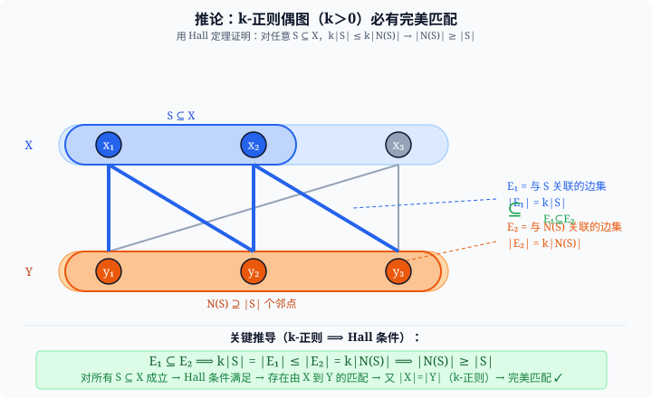

> 最近发现图论课本没几个图，就让 AI 搞了点图

## 1. 基本概念

### 1.1 匹配

设 $G=(V,E)$。**匹配（matching）** $M \subseteq E$ 满足：$M$ 中任意两边无公共端点。

- **M-饱和（M-saturated）**：端点都属于 $M$ 中某边 → 已被"匹配上"的顶点。
- **M-非饱和（M-unsaturated / exposed）**：未被 $M$ 中任何边覆盖的顶点。

| 概念 | 定义 |
|---|---|
| **最大匹配** | $\mid M \mid$ 最大的匹配 |
| **完美匹配（perfect matching）** | $M$ 饱和 $V$ 中**所有**顶点，即 $\mid M\mid =\tfrac{n}{2}$ |
| **最大二部匹配（X-saturating）** | 偶图 $G=(X,Y)$ 中，$M$ 饱和 $X$ 的所有顶点 |

> **完美匹配的必要条件**：$n$ 必须是偶数（否则一定有暴露顶点）。

### 1.2 M-交替路与 M-可扩路

- **M-交替路（M-alternating path）**：沿路依次交替出现"非匹配边 → 匹配边 → 非匹配边 → …"。
- **M-可扩路（M-augmenting path）**：M-交替路，且**两端点均为 M-非饱和顶点**。

可扩路的关键性质：将路上的匹配边与非匹配边互换（"翻转"），匹配大小增加 1：

$$M' = M \triangle P \quad \Rightarrow \quad |M'| = |M| + 1.$$

（$\triangle$ 是对称差：$A\triangle B=(A\cup B)\setminus(A\cap B)$）

---

## 2. 伯格定理（Berge, 1957）

> **定理**　匹配 $M$ 是最大匹配 $\iff$ $G$ 中不存在 $M$-可扩路。

### 证明

**（⟸ 方向）若无可扩路，则 $M$ 最大**：逆否显然——若存在可扩路 $P$，翻转得 $|M\triangle P|=|M|+1$，矛盾。

**（⟹ 方向）若 $M$ 是最大匹配，则无可扩路**：设 $M_1$ 是另一个匹配且 $|M_1|>|M|$，令 $H=M_1\triangle M$。

$H$ 的结构分析（关键步骤）：
1. $H$ 中每个顶点度 $\leq 2$（每顶点在 $M$ 中至多 1 条边、在 $M_1$ 中至多 1 条边）。
2. 故 $H$ 的每个连通分量是**简单路或圈**，且**边在 $M$ 和 $M_1$ 中交替出现**。
3. 在**偶圈**分量中，$|M_1\cap C|=|M\cap C|$，对差值无贡献。
4. 在**路**分量中，路两端的边属于同一个匹配，若 $|M_1|>|M|$ 则某条路满足 $|M_1\cap P|=|M\cap P|+1$。

$$|M_1| > |M| \Rightarrow \text{存在路分量 } P \text{ 使得 }|M_1 \cap P| > |M \cap P|$$

这样的路 $P$ 两端点均为 $M$-非饱和 → $P$ 是 $M$-可扩路。矛盾。$\blacksquare$

---

## 3. 霍尔定理（Hall, 1935）

设 $G=(X\cup Y,E)$ 是二部图，$|X|\leq|Y|$。

> **定理**　$G$ 存在饱和 $X$ 中每个顶点的匹配（称为 **X-饱和匹配**）
> $$\iff \quad \forall S \subseteq X,\quad |N(S)| \geq |S|.$$
> 右边称为 **Hall 条件**（相异代表系条件）。

### 证明

**（⟹ 方向）**：若存在 $X$-饱和匹配 $M^*$，对任意 $S\subseteq X$，$M^*$ 把 $S$ 的每个点映到 $Y$ 中不同的一点，故 $|N(S)|\geq|S|$。

**（⟸ 方向）**：设 Hall 条件成立但 $G$ 无 $X$-饱和匹配，取 $G$ 中最大匹配 $M^*$，设 $u\in X$ 为 $M^*$-非饱和点。

构造集合：

$$Z = \{v \in V \mid \exists \text{ 从 } u \text{ 出发的 } M^*\text{-交错路到达 } v\}.$$

令 $S = X\cap Z$，$T = Y\cap Z$，则：

1. $u \in S$（$u$ 到自己长度为 0 的路）。
2. 对任意 $xy \in E$ 且 $x\in S$，$y\in T$（否则 $y\in Y\setminus T$，可从 $u$ 经过 $x$ 到 $y$，矛盾；若 $y\in T$ 且 $y$ 被 $M^*$ 饱和，则存在 $M^*$-边 $yx'$ 使 $x'\in S$）。
3. 因此 $N(S)=T$（$S$ 的邻域恰好是 $T$）。
4. $M^*$ 将 $T$ 中每个点与 $S\setminus\{u\}$ 中的点——一一对应（因为 $u$ 是非饱和点，$S$ 其余点都被 $M^*$ 饱和）：

$$|T| = |S| - 1 < |S|.$$

故 $|N(S)|=|T|<|S|$，Hall 条件不成立，矛盾。$\blacksquare$

### 推论：相异代表系（SDR）

有限集族 $\mathcal{F}=\{A_1,\dots,A_n\}$，**相异代表系（SDR）** 是从各 $A_i$ 各取一个不同的代表元 $a_i$。

$$\text{SDR 存在} \iff \forall I\subseteq\{1,\dots,n\},\quad \left|\bigcup_{i\in I} A_i\right| \geq |I|.$$

建二部图：左侧放 $A_i$，右侧放全集元素，$A_i$ 与它包含的元素连边，Hall 定理即得。

---

## 4. 柯尼希（哥尼）定理（König, 1931）

**顶点覆盖（vertex cover）**：顶点子集 $K\subseteq V$，使得 $G$ 的**每条边**至少有一个端点在 $K$ 中。

> **定理（König，仅对二部图成立）**
> $$\text{最大匹配的大小} = \text{最小顶点覆盖的大小}.$$
> 即 $\nu(G) = \tau(G)$（$\nu$ = matching number，$\tau$ = vertex cover number）。

> **一般图中 $\nu(G)\leq\tau(G)$ 恒成立**（每条匹配边至少需要一个端点来覆盖），König 定理给出等号，且仅二部图保证等号。

### 证明

设 $G=(X\cup Y,E)$ 为二部图，$M^*$ 是最大匹配，$|M^*|=\nu$。沿 Hall 定理中的符号：

取 Hall 定理证明中的 $S\subseteq X$、$T\subseteq Y$（从每个 $M^*$-非饱和的 $u\in X$ 出发建交错树，取所有这类 $u$ 的并集来定义 $S,T$），令

$$K^* = (X \setminus S) \cup T.$$

**$K^*$ 是顶点覆盖**：设 $xy\in E$，$x\in X$，$y\in Y$。
- 若 $x\in X\setminus S$，则 $x\in K^*$，边被覆盖。
- 若 $x\in S$，由 $N(S)=T$ 知 $y\in T\subseteq K^*$，边被覆盖。

**$|K^*|=\nu$**：
- $|X\setminus S|$ = $M^*$ 中饱和 $X$ 点的数量（因 $S$ 恰好是从非饱和点出发能到达的 $X$ 点）= $|M^* \text{ 中匹配了 } X \text{ 一侧的边数}|$。
- $|T|$ = $M^*$ 中被"借路"进入 $T$ 的 $Y$ 点数 = 同一批边的 $Y$ 一侧端点数。
- 两者不重叠，之和恰 $|M^*|=\nu$。

因此 $|K^*|=\nu$，而最小覆盖 $\tau\leq|K^*|=\nu\leq\tau$，故 $\nu=\tau$。$\blacksquare$

### 推论：独立集与覆盖的关系

- **独立集（independent set）**：顶点子集，任意两点不相邻。最大独立集大小 $\alpha(G)$。
- **对偶关系**：$K$ 是覆盖 $\iff$ $V\setminus K$ 是独立集，故 $\alpha(G)+\tau(G)=n$。
- 对二部图：$\alpha(G)+\nu(G)=n$（König）。

---

## 5. 匈牙利算法（Hungarian Algorithm）

在二部图 $G=(X\cup Y,E)$ 中寻找最大匹配（或 $X$-饱和匹配）的算法。

### 算法流程

从初始匹配 $M=\emptyset$ 开始，反复做：

**(a) 选根**：找一个 $M$-非饱和的 $x_0\in X$；若不存在，$M$ 已是 $X$-饱和匹配，**结束**。

**(b) 生长交错树**：从 $x_0$ 出发，BFS/DFS 生长 $M$-交错树 $H$：
  - $S = V(H)\cap X$，$T = V(H)\cap Y$。
  - 每次沿**非匹配边**从 $S$ 扩展到 $Y$ 中新点，再沿**匹配边**（若存在）从 $Y$ 扩展回 $X$。

**(c) 两种终止情形**：
| 情形 | 条件 | 动作 |
|---|---|---|
| **Case 1** | $N(S)=T$（树不能再扩展） | 输出"无 $X$-饱和匹配"，停止 |
| **Case 2** | 到达 $M$-非饱和的 $y\in Y$ | 找到可扩路 $P$，令 $M\leftarrow M\triangle P$，回 (a) |

### 复杂度

$|X|=|Y|=n$，每轮 (a)→(b)→(c) 最坏扫遍 $m$ 条边，共 $n$ 轮 → $O(nm)$。

---

## 6. 托特定理（Tutte, 1947）

> **定理**　（一般图）$G$ 有完美匹配
> $$\iff \quad \forall S \subseteq V,\quad o(G-S) \leq |S|.$$
> 其中 $o(G-S)$ 是 $G-S$ 的**奇数阶连通分量**的个数。

### 为什么奇分支是障碍

若 $G$ 有完美匹配 $M$，每个奇分支（|顶点数| 为奇）内部的点无法全部被 $M$ 内的边配对（奇数个点，完美配对要求偶数），故至少有一条匹配边从该分支跨到 $S$。由于 $M$ 中跨边两两不共顶点，每条跨边占用 $S$ 的一个顶点，故 $o(G-S)\leq|S|$。

### 证明思路（⟸ 方向简述）

反向用归纳法证：若 Tutte 条件成立则存在完美匹配（需详细归纳，此处略去，只用结论）。

---

## 7. 彼得森定理（Petersen, 1891）

> **定理**　每个**无割边**的 **3-正则图**都有完美匹配。

### 证明（用 Tutte 定理）

设 $G$ 是无割边的 3-正则图，任取 $S\subseteq V$，设 $G-S$ 有 $k$ 个奇分支 $G_1,\dots,G_k$。

对每个奇分支 $G_i$，令 $m_i$ = 从 $S$ 到 $G_i$ 的边数，则（在 $G$ 中看 $G_i$ 的顶点总度数）：

$$3|V(G_i)| = 2|E(G_i)| + m_i \quad \Rightarrow \quad m_i = 3|V(G_i)| - 2|E(G_i)|.$$

- $|V(G_i)|$ 是奇数，$2|E(G_i)|$ 是偶数，故 $m_i$ 为**奇数**。
- 无割边 $\Rightarrow$ $m_i\neq 1$（否则 $G_i$ 与 $S$ 之间只有一条边，即割边）。
- 奇数且 $\geq 2$ $\Rightarrow$ $m_i\geq 3$。

对 $S$ 的顶点总度数（$G$ 是 3-正则）：

$$3|S| = 2|E(G[S])| + \sum_{i=1}^{k} m_i \geq \sum_{i=1}^{k} m_i \geq 3k = 3\,o(G-S).$$

故 $o(G-S)\leq|S|$，Tutte 条件成立，$G$ 有完美匹配。$\blacksquare$

---

## 8. 推论：$k$-正则二部图（$k>0$）必有完美匹配

**证明**：设 $G=(X\cup Y,E)$ 是 $k$-正则二部图，对任意 $S\subseteq X$，令

$$E_1 = \{e\in E \mid e \text{ 有端点在 } S\},\quad E_2 = \{e\in E \mid e \text{ 有端点在} N(S)\}.$$

由 $k$-正则：$|E_1|=k|S|$，$|E_2|=k|N(S)|$。又 $E_1\subseteq E_2$（$S$ 的每条出边的另一端点在 $N(S)$），故

$$k|S| = |E_1| \leq |E_2| = k|N(S)| \quad \Rightarrow \quad |N(S)|\geq|S|.$$

Hall 条件成立，存在 $X$-饱和匹配。又 $k$-正则 $\Rightarrow$ $|X|=|Y|$，故该匹配是完美匹配。$\blacksquare$

---

## 9. 概念辨析

| 概念对 | 区别 |
|---|---|
| **最大匹配 vs 完美匹配** | 最大匹配保证 $|M|$ 最大，未必覆盖所有顶点；完美匹配覆盖所有顶点（当 $|X|=|Y|$ 时完美 $\Rightarrow$ 最大，反之不然） |
| **M-交替路 vs M-可扩路** | 可扩路是特殊的交替路：**两端点均为非饱和顶点**。存在可扩路 $\iff$ $M$ 不是最大匹配（Berge）|
| **顶点覆盖 vs 独立集** | 互补：$K$ 覆盖 $\iff$ $V\setminus K$ 独立；$\tau+\alpha=n$ |
| **König 定理的适用范围** | 仅二部图：$\nu=\tau$；一般图只有 $\nu\leq\tau$ |
| **Hall vs König** | Hall 给出"何时存在 $X$-饱和匹配"；König 给出最大匹配 = 最小覆盖（利用了 Hall 的证明构造）|

---

## 10. 易错点与伏笔

1. **Tutte 定理的 $S=\emptyset$ 情形**：$o(G)\leq 0$，等价于要求 $G$ 无奇分支，即 $G$ 各连通分量都是偶阶——这是完美匹配的必要条件。

2. **König 定理只对二部图成立**：$K_3$（三角形，$\nu=1,\tau=2$）是反例。

3. **匹配的对称差 $M_1\triangle M_2$**：每个分量是偶圈或路，且边交替属于两个匹配——这是 Berge 证明的核心，也是"翻转"操作的基础。

4. **彼得森定理的前提**：**无割边**（bridgeless）缺一不可；有割边的 3-正则图不一定有完美匹配（例：两个 $K_4$ 用一条割边相连，$n=8$，但两个三度顶点连割边的分量奇数顶点 → 可以验证 Tutte 条件被违反）。

5. **下章联动**：König 定理的二部图特例 $\chi'(G)=\Delta(G)$（边着色），是 König 匹配定理在边着色中的直接应用。

---

## 11. 核心公式速查

$$|M \triangle P| = |M|+1 \quad (P \text{ 是 }M\text{-可扩路，翻转后})$$

$$\text{Hall 条件：} \forall S\subseteq X,\; |N(S)|\geq|S|$$

$$\text{König：} \nu(G)=\tau(G) \quad (G \text{ 是二部图})$$

$$\alpha(G)+\tau(G)=n \quad (\text{独立集与覆盖互补})$$

$$\text{Tutte：} o(G-S)\leq|S| \iff G \text{ 有完美匹配}$$

$$m_i = 3|V(G_i)|-2|E(G_i)| \geq 3 \quad (G \text{ 是无割边 3-正则，Petersen 定理关键步})$$
