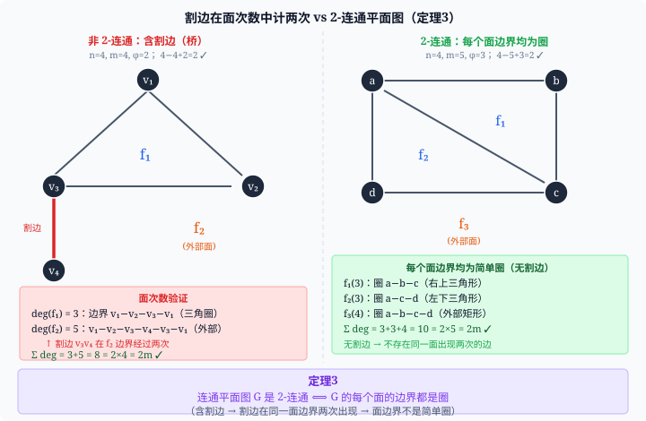
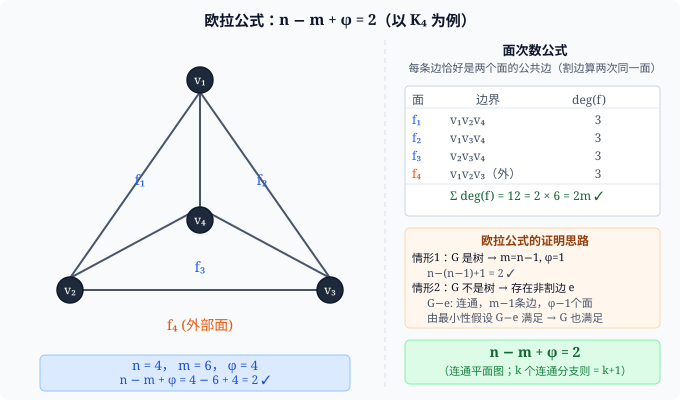
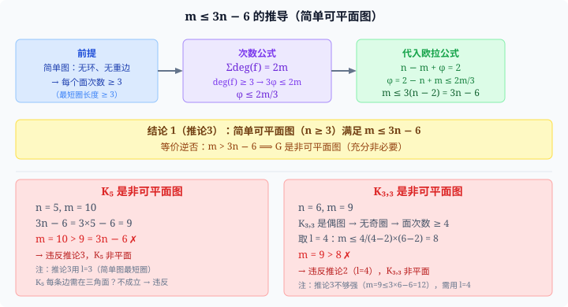
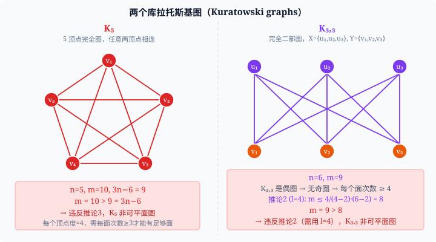
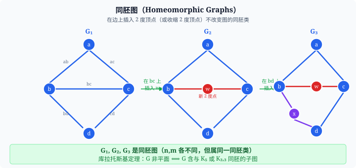
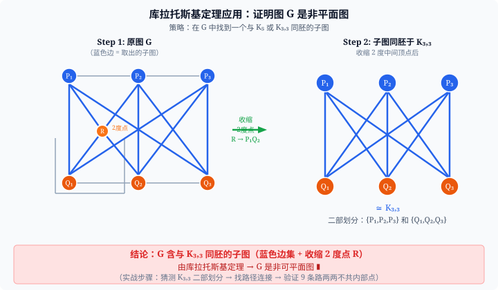
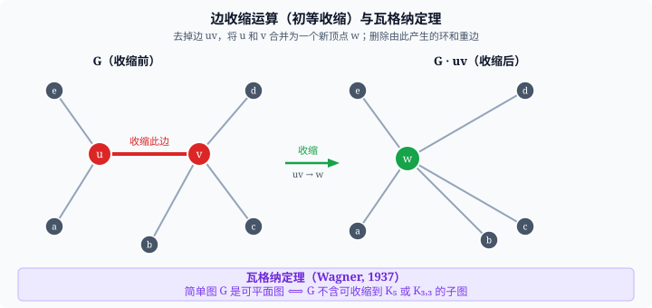

## 1. 基本概念

### 1.1 可平面图与平面嵌入

> **定义**　若图 $G$ 可以画在平面上，使得除顶点外边与边之间没有交叉，称 $G$ 是**可平面图（planar graph）**，该画法称为 $G$ 的一种**平面嵌入（planar embedding）**。平面嵌入的图称为**平面图**。

注：「可平面图」与「平面图」在不引起混淆时等同使用。

### 1.2 面（region / face）

平面图 $G$ 将平面分成若干**连通片**，称为 $G$ 的**面**（记面集合为 $\Phi$）。

- **内部面**：面积有限的面。
- **外部面（无界面）**：面积无限的那个唯一的面。

> $G$ 的面数记为 $\varphi = |\Phi|$。

### 1.3 面的次数（degree of a face）

面 $f$ 的**边界**：$G$ 中与 $f$ 关联的顶点和边组成的子图。

**面 $f$ 的次数** $\deg(f)$：边界中边的数目，其中**割边（bridge）**计两次（因为它同时在 $f$ 两侧）。

**例**（$K_4$ 平面图）：4 个面各 $\deg = 3$，$\sum \deg(f_i) = 12 = 2 \times 6 = 2m$。

---

## 2. 平面图的性质

### 2.1 面次数公式

> **定理 1**　设 $G=(n,m)$ 是平面图，则
> $$\sum_{f \in \Phi} \deg(f) = 2m.$$

**证明**：每条边 $e$：若 $e$ 是割边，则 $e$ 在同一个面的边界上计两次；若 $e$ 不是割边，则 $e$ 恰是两个面的公共边各计一次。故每条边恰好贡献 2 到总次数之和。$\blacksquare$

（与握手定理 $\sum d(v) = 2m$ 完全对称——这是"面-边"的对偶版本。）

### 2.2 欧拉公式

> **定理 2（欧拉公式）**　设 $G=(n,m)$ 是**连通**平面图，$\varphi$ 是面数，则
> $$n - m + \varphi = 2.$$

**证明**：
- **情形 1（$G$ 是树）**：$m = n-1$，$\varphi = 1$（只有外部面），$n-(n-1)+1=2$。$\checkmark$
- **情形 2（$G$ 不是树）**：$G$ 有非割边 $e$。则 $G-e$ 仍连通（边数 $m-1$，面数 $\varphi-1$，顶点数 $n$ 不变）。由归纳假设，$G-e$ 满足欧拉公式：
$$n-(m-1)+(\varphi-1)=2 \implies n-m+\varphi=2. \quad \blacksquare$$

**推论 1**：$G$ 有 $k$ 个连通分支时，$n - m + \varphi = k+1$。

---

## 3. 欧拉公式的推论（边数上界）

### 推论 2（一般面次数下界）

若连通平面图每个面次数 $\geq l \geq 3$，则

$$m \leq \frac{l}{l-2}(n-2).$$

**推导**：$l\varphi \leq \sum \deg(f) = 2m \Rightarrow \varphi \leq \dfrac{2m}{l}$。代入 $\varphi = 2-n+m$：

$$2-n+m \leq \frac{2m}{l} \implies m\left(1-\frac{2}{l}\right) \leq n-2 \implies m \leq \frac{l}{l-2}(n-2).$$

### 推论 3（简单平面图边数上界）

> 简单连通平面图（$n \geq 3$）：$m \leq 3n - 6$。

取 $l=3$（简单图最短圈为三角形）代入推论 2 即得。

**逆否**：若 $m > 3n-6$，则 $G$ 是非平面图。这是判定非平面图最便捷的**必要条件**。

### 推论 4（等号条件）

若 $G$ 每个面恰好由长为 $l$ 的圈围成，则 $m(l-2) = l(n-2)$。

### 推论 5（最小度上界）

> 简单平面图：$\delta(G) \leq 5$。

**证明**：若 $\delta \geq 6$，则 $2m = \sum d(v) \geq 6n \Rightarrow m \geq 3n > 3n-6$，违反推论 3。$\blacksquare$

> 注：这是证明「五色定理」的出发点——平面图必存在度数 $\leq 5$ 的顶点，可做归纳。

### 两个核心非平面图的证明

| 图 | $n$ | $m$ | 用哪个推论 | 违反条件 |
|---|---|---|---|---|
| $K_5$ | 5 | 10 | 推论 3（$l=3$）| $m=10 > 3\times5-6=9$ |
| $K_{3,3}$ | 6 | 9 | 推论 2（$l=4$，偶图无奇圈）| $m=9 > \frac{4}{2}(6-2)=8$ |

> **关键**：$K_{3,3}$ 不能用推论 3（$m=9 \leq 3\times6-6=12$ 不违反），必须用 $l=4$！推论 3 只是必要条件，不是充分条件。

---

## 4. 特殊平面图

### 4.1 2-连通平面图与面边界

> **定理 3**　连通平面图 $G$ 是 2-连通的，当且仅当每个面的边界都是圈。

**推论 6**：2-连通平面图的每条边恰好在两个面的边界上。

### 4.2 凸多面体与 5 种正多面体

凸多面体 → 压扁到平面 → 得到简单平面正则图（每面次数 $l$，每顶点度 $r$）。

由次数公式 $2m=\varphi l$，握手定理 $2m=nr$，代入欧拉公式，可以解得：

$$n = \frac{4l}{2l - lr + 2r}$$

$n > 0$ 要求 $2(l+r) > lr$，即：

$$\frac{1}{l} + \frac{1}{r} > \frac{1}{2}, \quad l \geq 3,\; r \geq 3$$

**该不等式组的正整数解恰好 5 组**：

| 序号 | $l$ | $r$ | $n$ | $m$ | $\varphi$ | 正多面体 |
|:---:|:---:|:---:|:---:|:---:|:---:|:---:|
| 1 | 3 | 3 | 4 | 6 | 4 | 正四面体 |
| 2 | 3 | 4 | 8 | 12 | 6 | 正方体（正六面体）|
| 3 | 3 | 5 | 20 | 30 | 12 | 正十二面体 |
| 4 | 4 | 3 | 6 | 12 | 8 | 正八面体 |
| 5 | 5 | 3 | 12 | 30 | 20 | 正二十面体 |

**→ 正多面体恰好只有 5 种。** 欧拉公式在两千年前就已预言了这个事实。$\blacksquare$

---

## 5. 平面图的判定

### 5.1 同胚图（Homeomorphic graphs）

- **2 度顶点内扩充**：在边 $uv$ 上插入一个新的 2 度顶点 $w$，边 $uv$ 变成路 $u$-$w$-$v$。
- **2 度顶点内收缩**：去掉 2 度顶点 $w$，将关联的两条边合为一条边。
- **同胚**：$G_1$ 与 $G_2$ 同胚，若它们同构，或经过若干次上述操作后同构。

> 平面性在同胚意义下不变（同胚图要么都是平面图，要么都不是）。

### 5.2 库拉托斯基定理（Kuratowski, 1930）

> **定理（Kuratowski）**　图 $G$ 是可平面图，当且仅当它不含与 $K_5$ 或 $K_{3,3}$ 同胚的子图。

等价叙述（逆否）：**$G$ 是非平面图 $\iff$ $G$ 含 $K_5$ 或 $K_{3,3}$ 的同胚子图。**

**使用步骤**（证明某图非平面）：
1. 检验推论 3：若 $m > 3n-6$ 则已够；否则继续。
2. 猜测 $K_5$ 或 $K_{3,3}$ 的分拆（顶点分组 / 路径分配）。
3. 在 $G$ 中找到覆盖这些路径的边子集，验证 $K_{3,3}$（共 9 条边 / 路径，两两不共内部顶点）。
4. 收缩其中 2 度中间点，得到 $K_{3,3}$ 或 $K_5$ → 由定理得非平面。

### 5.3 瓦格纳定理（Wagner, 1937）

**初等收缩（边收缩）**：对边 $uv$，删去它并将 $u,v$ 合并为新顶点 $w$（删去产生的环和重边）。

**$G$ 可收缩到 $H$**：$G$ 经一系列边收缩操作后可得到 $H$。

> **定理（Wagner）**　简单图 $G$ 是可平面图，当且仅当它不含可收缩到 $K_5$ 或 $K_{3,3}$ 的子图。

> **Kuratowski vs Wagner**：
> - Kuratowski 用的是"同胚子图"（保留 2 度顶点形态）
> - Wagner 用的是"可收缩子图"（更宽松，允许多余边被同时收缩）
> - 两者都是充要条件，在简单图上等价

---

## 6. 涉及平面性的不变量

> **推论**：$n \geq 9$ 阶简单可平面图的补图是非平面图。

**证明**：设 $G$ 是 $n$ 阶可平面图，则 $m(G) \leq 3n-6$。

$$m(\bar{G}) = m(K_n) - m(G) \geq \frac{n(n-1)}{2} - (3n-6)$$

令 $f(n) = \frac{1}{2}(n^2-13n+24)$，当 $n \geq 11$ 时 $f(n) > 0$，故 $m(\bar{G}) > 3n-6$，$\bar{G}$ 是非平面图。（验证 $n=8$ 时可构造两者都平面的例子，$n=9$ 起补图必非平面。）$\blacksquare$

---

## 7. 概念辨析

| 概念对 | 关键区别 |
|---|---|
| **可平面图 vs 平面图** | 可平面图是抽象的图论性质；平面图是它的一种具体平面嵌入画法（含面结构）|
| **内部面 vs 外部面** | 面积有限 = 内部面；唯一面积无限的 = 外部面（但欧拉公式把它一视同仁计入 $\varphi$）|
| **同胚 vs 同构** | 同构：顶点 / 边一一对应；同胚：允许在边上插入 / 删去 2 度顶点后再同构（更宽的等价关系）|
| **Kuratowski vs Wagner** | Kuratowski 用「同胚子图」，Wagner 用「可收缩子图」；在简单图上等价但概念不同 |
| **推论 3 vs 推论 2** | 推论 3 取 $l=3$（一般简单图）；对偶图或特殊图取更大 $l$ 可得更紧的界（如 $K_{3,3}$ 须用 $l=4$）|

---

## 8. 易错点与伏笔

1. **$K_{3,3}$ 用推论 3 无法判定**：$m(K_{3,3})=9 \leq 3\times6-6=12$，推论 3 给的是**必要**条件（$m>3n-6\Rightarrow$ 非平面），不是充分条件。必须用 $l=4$ 的推论 2。

2. **面次数中割边计两次**：若图有割边 $e$，则 $e$ 在同一面的边界上出现两次，$\deg(f)$ 贡献为 2。

3. **欧拉公式中 $\varphi$ 含外部面**：$\varphi=$ 所有面数（内部 + 外部），对简单环 $C_n$：$n=n,m=n,\varphi=2$，验证 $n-n+2=2$。$\checkmark$

4. **推论 3 的前提**：$n\geq3$（$n\leq2$ 时简单图至多 1 条边，$3n-6$ 可能为负，命题无意义）。

5. **$\delta(G)\leq5$ 的深远意义**：这个看似简单的推论直接引出了五色定理的证明策略——平面图必存在度数 $\leq5$ 的顶点，可对顶点数做归纳着色。

---

## 9. 核心公式速查

$$\sum_{f\in\Phi}\deg(f)=2m \quad \text{（面次数公式，类比握手定理）}$$

$$n - m + \varphi = 2 \quad \text{（欧拉公式，连通平面图）}$$

$$n - m + \varphi = k+1 \quad \text{（}k\text{ 个连通分支）}$$

$$m \leq \frac{l}{l-2}(n-2) \quad \text{（每面次数}\geq l\geq3\text{）}$$

$$m \leq 3n-6 \quad \text{（简单可平面图，}l=3\text{）}$$

$$m \leq 2n-4 \quad \text{（简单二部可平面图，}l=4\text{）}$$

$$\delta(G) \leq 5 \quad \text{（简单平面图）}$$

$$\frac{1}{l}+\frac{1}{r}>\frac{1}{2} \quad (l\geq3,r\geq3) \quad \text{（5 种正多面体的充要条件）}$$
