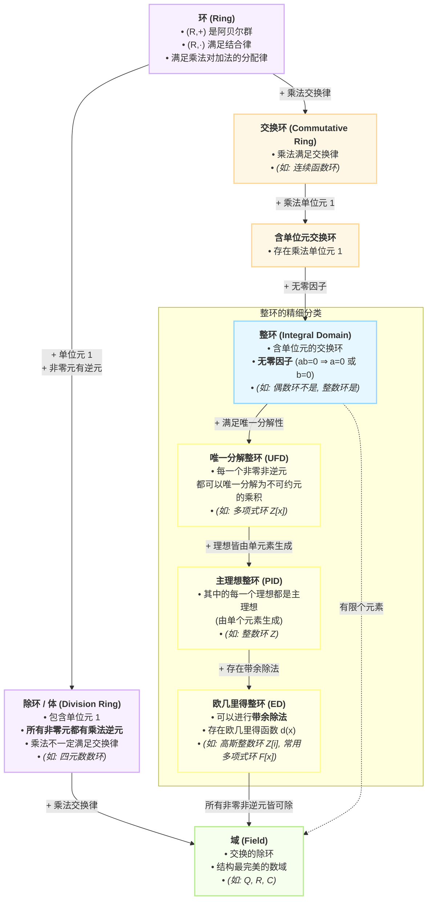

# 环的基本概念
## 环的定义
环是一个代数结构，由一个非空集合 \(R\) 和两个二元运算（加法 \(+\), 乘法 \(\cdot\)）组成，满足：

1. **加法群**：\((R, +)\) 构成阿贝尔群（交换群），存在零元 \(0\) 且每个元有负元。  
2. **乘法半群**：\((R, \cdot)\) 满足结合律，即 \((a \cdot b) \cdot c = a \cdot (b \cdot c)\)。 **不要求满足交换律**（如矩阵环 $M_n(\mathbb{R})$）
3. **分配律**：乘法对加法满足左右分配律：  
   \(a \cdot (b + c) = a \cdot b + a \cdot c\)，  
   \((b + c) \cdot a = b \cdot a + c \cdot a\)。

若乘法有单位元 \(1\)，则称**含幺环**；若乘法可交换，则称**交换环**。

## 环的各种子概念之间的关系

